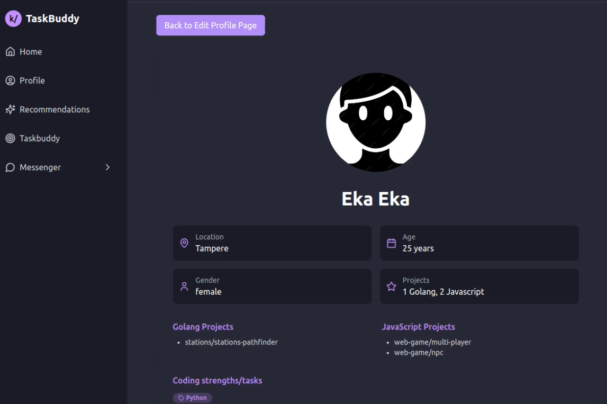

# Match Me  - TaskBuddy

A taskbuddy recommendation application, to connect kood/Sisu students based on their profile information.   





## Before starting the program  

-   npm install (cd frontend)
-   Connect to database
-   (optional: use Dbeaver to browse tables)
-   go mod tidy (cd backend)


## Starting the program     

```
cd frontend 
npm run dev 
```

Type in web browser:
```
localhost:5173
```

Register account, log in and save your profile.

Stop server:
```
Ctrl+C
```

Create 2000 example users:    
```
npm run seed:2000    
```
or 100 or 200 fake profiles:
```
npm run seed:200
```

Start server again:
```
npm run dev 
```

## Log in as fake person     

Look the id of your fake person in profile table. They have same id in user table, use that email.
```
fakeemail@mail.com
password123 
```


## TaskBuddy    

### Register    
     
- **Email**  
- **Password**  
- **Username** 

### Log in  

- **Email**  
- **Password**  

### Edit your profile   

- **Name**  
- **Birth Date**  
- **Gender**   
- **City**  
- **Security Word**  
- **My projects**      
- **Discord Name**  
- **Link to your projects**  
- **Biography**  
- **Coding skills**  
- **Tasks**   
- **Remove your profile image**     

View your profile card:     
- **profile picture, name, location, age, gender, Discord, Tasks, projects, coding skills, bio**    
  

### Home Page       

- **Online friends**      
- **New messages**      
- **Conection requests**    
- **Average match rate**    
- **Recent matches**    
- **Recent activity**    

### Recommendations     

- **Scroll recommendation cards**  
- **Friend request button**  
- **Remove button** 

### Taskbuddies       

View pending friend requests:      
- **Accept button**
- **Remove button**      

See sent friend requests:      
- **Remove button**      

A list of your buddies:     
- **View profile button**     
- **Remove button**      

Buddyprofile card:     
- **Profile picture, name, location, age, gender, Discord, Tasks, projects, coding skills, bio**       

Messenger:  
- **List of your buddies**      
- **Chat with your buddy**    
- **COnline indicator**       

### Other 

- **Log out button**    
- **Remember me -button**        


## Using PostgreSQL 

in terminal login with superuser

```
sudo -u postgres psql
```
create user 

```
CREATE USER koodsisu WITH PASSWORD '1234'
```
create database

```
CREATE DATABASE match OWNER koodsisu;
```
exit

```
\q
```


Connect to your PostgreSQL database 

```
psql -h localhost -U koodsisu -d match -W   
```
password: 1234  

- `-h localhost`: Specifies the host where the PostgreSQL server is running. In this case, it's `localhost`.    
- `-U koodsisu`: Specifies the username to connect with. In this case, it's `koodsisu`. 
- `-d match`: Specifies the database name to connect to. In this case, it's `match`.    
- `-W`: Prompts for the password.   

### Example Commands    

- **List all tables:**  
  ```
  \dt
  ```

- **Browse a specific table:**  
  ```
  SELECT * FROM "user";
  ```

- **Describe a table's structure:**     
  ```
  \d "user"
  ```

 - **Exit from viewing a table:**     
  ```
  q
  ``` 

- **Exit `psql`:**      
  ```
  \q
  ```

If you want to empty tables:
```
match=> DROP TABLE IF EXISTS "user" CASCADE;
```
and start server again.

### Example Session 

```
match=> \dt
              List of relations
 Schema |       Name       | Type  |  Owner   
--------+------------------+-------+----------
 public | activity         | table | koodsisu
 public | chat_message     | table | koodsisu
 public | friend_request   | table | koodsisu
 public | friends          | table | koodsisu
 public | profile          | table | koodsisu
 public | removed_profiles | table | koodsisu
 public | searchSettings   | table | koodsisu
 public | user             | table | koodsisu
(8 rows)

match=> SELECT * FROM "user";
 id |      email       |                           password                           | is_seed 
----+------------------+--------------------------------------------------------------+---------
  1 | laura1@gmail.com | $2a$10$M.TYGgLPSqnZ9p4cd9j0MepKckVMUZHHijW2DQkV9m7ROBORXNki2 | f
  2 | laura2@gmail.com | $2a$10$dLu0O3YHfRx53CfXN95bBue9Fk6nbC.UUZrKwnyGkFDr3DAKEkBsu | f
  3 | laura8@gmail.com | $2a$10$60R83K5nR29PWhcadIoaqOHUt0QlNSrOH8AnsYDJDqgJcgCo8FCI. | f
(3 rows)

match=> \q
```


## To browse tables in your PostgreSQL database using DBeaver, follow these steps:

### Step-by-Step Guide to Browse Tables via DBeaver

1. **Launch DBeaver:**

```
dbeaver &
```

2. **Create a New Database Connection:**
   - Click on "New Database Connection".
   - Select "PostgreSQL" and click "Next".
   - Enter your connection details:
     - **Host:** `localhost`
     - **Port:** `5432`
     - **Database:** `match`
     - **Username:** `koodsisu`
     - **Password:** `1234`
   - Click "Test Connection" to ensure the connection works.
   - Click "Finish".

3. **Browse Your Database Tables:**
   - Expand the connection in the Database Navigator panel.
   - Expand the "Schemas" node, then expand the "public" schema.
   - Expand the "Tables" node to see a list of all tables in your database.
   - Right-click on a table and select "View Data" > "All Rows" to see the data in the table.
   - Refresh table when changes are made.


## Match logic    

View matching.md.     


## Check enpoints   

View endpoint_responses.md.     


## Developers   

Raigo Hoim  
Jonathan Dahl   
Laura Levistö   

1/2025 